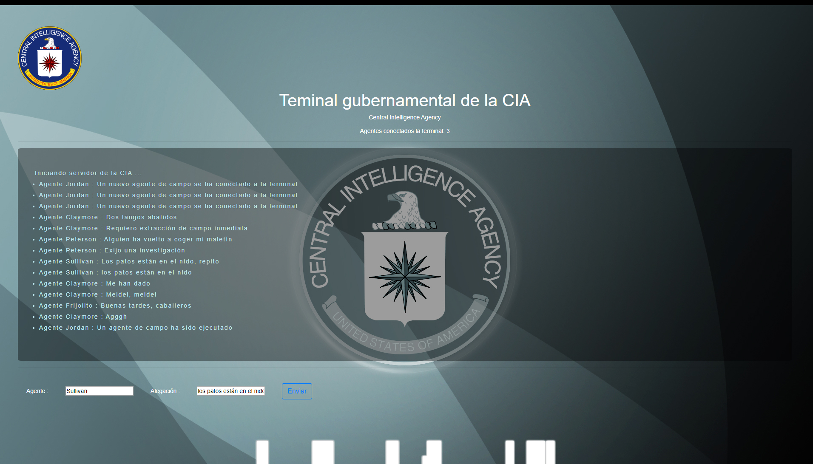
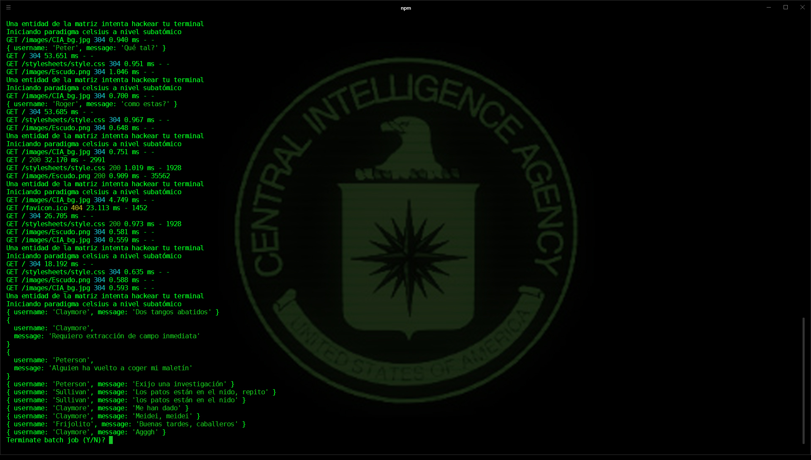

# CENTRAL INTELLIGENCE AGENCY - CHAT 

<a href="https://github.com/RollsKane"></a>By <a href="https://github.com/RollsKane">Rolls</a> :alien: 2020  
[](https://shields.io/)

Bienvenidos agentes!



_Prototipo de chat realizado en **Express** bajo **NodeJS**_

## Comenzando 🚀

_Bájate el repositorio a local para comenzar._

```
https://github.com/RollsKane/CIA_Terminal
```

### Pre-requisitos :computer:

#### Básicos

_Necesitas tener instalado Node JS_

```
https://nodejs.org/es/download/
```



### Instalación :floppy_disk:

_Una vez hallas bajado el proyecto de Git y tengas los pre-requisitos, situándote en la carpeta del proyecto, necesitas instalar las dependencias NPM_

```
npm install
```

_Para ejecutar el Chat de la CIA debemos situarnos en la carpeta de la app y escribir_

```
npm run startdev
```

_Situándote en la siguiente dirección, comprobamos que la app funciona_

```
http://localhost:3000
```

## Ejecutando Ngrok ⚙️

Si deseas emplear tu ordenador como servidor para emplear el chat con otros agentes, puedes emplear Ngrok

_Para ello hay que descargar Ngrok_

[Ngrok](https://bin.equinox.io/c/4VmDzA7iaHb/ngrok-stable-windows-amd64.zip)

- Una vez descargado el archivo, lo guardamos en una carpeta que no vayamos a borrar

- En windows, vamos a las variables del sistema, y en las variables genéricas creamos un nuevo path

- En el nuevo path copiamos la ruta de carpetas donde se encuentra **Ngrok.exe**

---

### Probando Ngrok 🔩

_Una vez nuestro server está levantado y funcionando en localhost:3000_
_verificamos si Ngrok funciona correctamente escribiendo el comando en la terminal_

```
ngrok
```

### Conectándote con otros agentes ⌨️

_Al ejecutar ngrok, el propio comando nos devolverá una serie de rutas por terminal. Copiando la segunda ruta y dándosela a otros amigos, podréis chatear por la terminal de la CIA_

```
Iniciando Protocolo Hasselhoff
```


## Construido con 🛠️

_Herramientas empleadas_

- [NodeJS](https://nodejs.org/en/) - JavaScript runtime
- [Express](https://rometools.github.io/rome/) - Framework

## Versionado 📌

Version 0.1

## Autor ✒️

_Autor del proyecto_

- **Roberto Julio Alamo** - _Trabajo Inicial_ - [Rolls](https://github.com/RollsKane)

## Licencia 📄

Este proyecto está bajo la Licencia MIT

## Expresiones de Gratitud 🎁

- Comenta a otros sobre este proyecto 📢
- Invita una cerveza 🍺 o un café ☕ a alguien del equipo.
- Da las gracias públicamente 🤓.
- etc.

---

⌨️ By [RollsKane](https://github.com/RollsKane) :alien:


